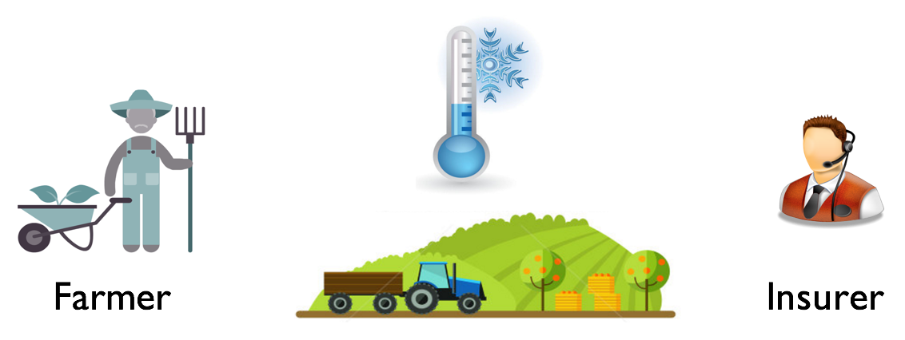
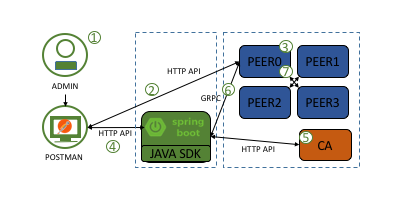
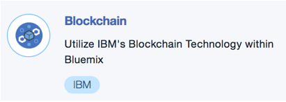
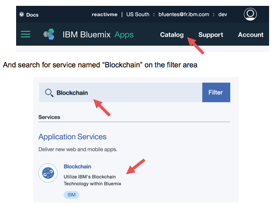
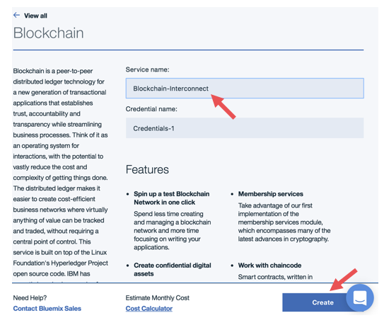
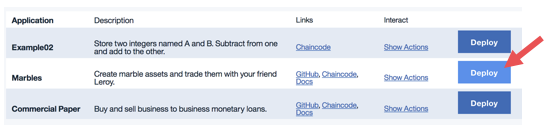

# JavaCDD Documentation
The documentation for JavaCDD tutorial

This tutorial helps you understand how to set a blockchain network locally based on Hyperledger Fabric V0.6, create a simple smart contract in Java and interact with it using the HTTP API and the SDK.

In the following sections you will discover how Blockchain technology can be used to sign contract between a farmer and an insurer and then to trigger changes on the contract’s state. CDD derivative is an insurance for farmers to hedge against poor harvests caused by failing rains during the growing period, excessive rain during harvesting, high winds in case of plantations or temperature variabilities in case of greenhouse crops. In a CDD case, every time the average day degree passes under a threshold, a client could receive a payment, smoothing earnings.

* Creating a contract between a farmer and an insurer
* Executing a contract based on a specific location
* Querying the contract State to know if the farmer has received a payment

In this business scenario each participant has entered into a business agreement with each other and all parties are known and trusted by each other. For each contract deployment, one instance of the java project is running on the Blockchain. For our example, we will create only one contract between two people, but you can do as many as you want.  

This demo has been simplified in the way:
* No security has been enabled and configured.
* We trust and assume that calls to Weather API will send back always the same value for each peer. We also trust Weather API data as a trustable oracle. (Calling a current temperature is NOT deterministic => Bad bad bad ! Normally it should be done the previous month average temperature to be sure to have a unique result)
* We can do unlimited calls. Normally in a real case, the contract should be executed once relatively to a period corresponding to the average temperature of the previous month
* The contract should contain a start and end date validity. You can do it as an extra exercise

The project is split into different sub projects listed here on section [References](#references)

An introduction to Bluemix Blockchain as a Service is part of this tutorial promoting the IBM infrastructure to host the network in Production. Remember that blockchain is a distributed system of several nodes, each one can consume potential high resources depending of the distributed applications you deploy on the network. For a tutorial is more suitable to run it on a development mode locally as we don't need such resources.

## Flow

This flow is in two part, first the user is interacting via HTTP directly to the peer without security.
Then, we have to develop a client application using the Java SDK. The user will interact via the HTTP API over the Spring Boot application.

1. The user opens Postman to do HTTP calls (DEPLOY,QUERY,INVOKE requests)
2. A query or invoke request is sent to a peer where a chaincode has been already deployed
3. The peer reads the Ledger state and/or creates a new transaction that is dispatched over the other peers
4. The user is using now the Spring Boot application API to interact with the blockchain network
5. As the application has started, the user has been enrolled with the CA
6. The application is using the Java SDK and the user certificate to communicate with the peer
7. Same as step 3

## Included Components
- [Hyperledger Fabric](https://www.hyperledger.org/)
- [Hyperledger Fabric Java SDK](https://github.com/hyperledger/fabric-sdk-java)
- [Spring Boot](https://projects.spring.io/spring-boot/)
- [Bluemix](https://console.ng.bluemix.net/)
- [Docker](https://www.docker.com)

## Prerequisites

- Bluemix account: [link](https://console.ng.bluemix.net/registration)
- Docker: [link](https://docs.docker.com/engine/installation/#platform-support-matrix)
- Docker compose (version > 1.10): [link](https://docs.docker.com/compose/install)
- Postman: [link](https://www.getpostman.com)
- Java JDK 8: [link](http://www.oracle.com/technetwork/java/javase/downloads/index-jsp-138363.html)
- Eclipse: [link](https://www.eclipse.org/downloads)
- Eclipse Maven plugin: (you can use the one embedded on Eclipse)
- Eclipse Gradle plugin: (depending on the version, it can be already included or [link](https://projects.eclipse.org/projects/tools.buildship))

## Steps

1. [Blockchain as a Service on Bluemix](#blockchain-as-a-service-on-bluemix)
2. [Set up the network](#set-up-the-network)
3. [Develop the chaincode](#develop-the-chaincode)
4. [Test with HTTP API](#test-with-http-api)
5. [Develop the application with SDK](#develop-the-application-with-sdk)
6. [Test with the Spring Boot application](#test-with-the-spring-boot-application)

# Blockchain as a Service on Bluemix

You can go to Bluemix and use a Blockchain as a Service 

If you do not have a Bluemix access yet, please register for a [free 30 days account](https://console.ng.bluemix.net/registration)

Go to [Bluemix Catalog](https://console.ng.bluemix.net/catalog)

Click on the service, give it a unique name and click on Create button

When finished, click on Launch Dashboard

Bluemix has created for you a Blockchain network of 4 peers to let you focus on developing smart contract applications on top of it.
Scroll the menu to explore:
- Network: 4 validating peers + Certificate Authority
- Blockchain: local view on the Blockchain for peer 0
- Demo Chaincode: Ready to deploy demos
- APIs: Swagger-like HTTP call interactions with Blockchain network/peers
- Logs: server logs on each peer
- Service Status: service info to let you know maintenance and service upgrades
- Support: helpful links

Now that you have a blockchain network running, go to the menu Demo Chaincode to play with one demo

# Set up the network

Now that you have tested a Blockchain on the Cloud, let’s do the same on your machine. We will explain a little bit more the way to deploy your own Blockchain network

Install Docker on your machine [here](https://docs.docker.com/engine/installation/#platform-support-matrix)

We will use Hyperledger official Docker images to start a Blockchain network of 4 peers + 1 CA (Certificate Authority)

Images are available [here](https://hub.docker.com/u/hyperledger)

If you encounter any problem during this lab, you can find links at the end of this document pointing to the correction. There you can verify if you have done any mistake.

All commands below are for Unix machines (Linux, MacOs, Debian, Ubuntu, etc… ). If you use another OS like Windows, just transcript the command. We are using very basic commands that exists on all OS. 

1. Create a Docker file from the official image. Open a console and type theses commands (choose any workspace folder on your machine)

``
mkdir baseimage
  touch baseimage/Dockerfile
  echo "FROM hyperledger/fabric-peer:x86_64-0.6.1-preview" > baseimage/Dockerfile
``

2. Create the file for Docker compose

``
touch four-peer-ca.yaml 
``

# Develop the chaincode

//TODO

# Test with HTTP API

//TODO

# Develop the application with SDK

//TODO

# Test with the Spring Boot application

//TODO

## Contributing
[link](CONTRIBUTING.md)

## Troubleshooting
[maintainers link](MAINTAINERS.md)

## References
- [JavaCDD](https://github.com/zamrokk/JavaCDD) : the chaincode java project
- [JavaCDDNetwork](https://github.com/zamrokk/JavaCDDNetwork) : the scripts to create / destroy the blockchain network locally 
- [JavaCDDWeb](https://github.com/zamrokk/JavaCDDWeb): the client web application using the JavaSDK and exposing an API

# License
[Apache 2.0](LICENSE)
