# JavaCDD Documentation
The documentation for JavaCDD tutorial

This tutorial helps you understand how to set a blockchain network locally based on Hyperledger Fabric V0.6, create a simple smart contract in Java and interact with it using the HTTP API and the SDK.

In the following sections you will discover how Blockchain technology can be used to sign contract between a farmer and an insurer and then to trigger changes on the contract’s state. CDD derivative is an insurance for farmers to hedge against poor harvests caused by failing rains during the growing period, excessive rain during harvesting, high winds in case of plantations or temperature variabilities in case of greenhouse crops. In a CDD case, every time the average day degree passes under a threshold, a client could receive a payment, smoothing earnings.

* Creating a contract between a farmer and an insurer
* Executing a contract based on a specific location
* Querying the contract State to know if the farmer has received a payment


In this business scenario each participant has entered into a business agreement with each other and all parties are known and trusted by each other. For each contract deployment, one instance of the java project is running on the Blockchain. For our example, we will create only one contract between two people, but you can do as many as you want.  

This demo has been simplified in the way:
* We trust and assume that calls to Weather API will send back always the same value for each peer. We also trust Weather API data as a trustable oracle. (Calling a current temperature is NOT deterministic => This is bad ! Normally it is done on the previous month average temperature and it is deterministic)
* We can do unlimited calls with our application. Normally in a real case, the contract should be executed once at the end of each month
* The contract should contain a start + end validity date. You can do it as an extra exercise


The project is split into different sub projects listed here on section [References](#references)

An introduction to Bluemix Blockchain as a Service is part of this tutorial promoting the IBM infrastructure to host the network in Production. Remember that blockchain is a distributed system of several nodes, each one can consume potential high resources depending of the distributed application complexity you deploy on the network. For a tutorial is more suitable to run it on a development mode locally as we don't need such resources.

## Flow

This flow is in two part, first the user is interacting via HTTP directly to the peer without security.
Then, we develop a client application using the Java SDK with security enabled. The user will interact via the HTTP API on top of the Spring Boot application.


1. The user opens Postman to do HTTP calls (DEPLOY,QUERY,INVOKE requests)
2. A query or invoke request is sent to a peer where a chaincode has been already deployed
3. The peer reads the Ledger state and/or creates a new transaction which is dispatched to the other peers
4. The user is using now the Spring Boot application API to interact with the blockchain network
5. When the application has started, the user has been enrolled with the CA
6. The application is using the Java SDK and the user certificate to communicate with the peer
7. Same as step 3

## Included Components
- [Hyperledger Fabric](https://www.hyperledger.org/)
- [Hyperledger Fabric Java SDK](https://github.com/hyperledger/fabric-sdk-java)
- [Spring Boot](https://projects.spring.io/spring-boot/)
- [Bluemix](https://console.ng.bluemix.net/)
- [Docker](https://www.docker.com)

## Prerequisites

- Bluemix account: [link](https://console.ng.bluemix.net/registration)
- Docker: [link](https://docs.docker.com/engine/installation/#platform-support-matrix)
- Docker compose (version > 1.10): [link](https://docs.docker.com/compose/install)
- Postman: [link](https://www.getpostman.com)
- Java JDK 8: [link](http://www.oracle.com/technetwork/java/javase/downloads/index-jsp-138363.html)
- Eclipse: [link](https://www.eclipse.org/downloads)
- Eclipse Maven plugin: (you can use the one embedded on Eclipse)
- Eclipse Gradle plugin: (depending on the version, it can be already included or [link](https://projects.eclipse.org/projects/tools.buildship))

## Steps


1. [Blockchain as a Service on Bluemix](#blockchain-as-a-service-on-bluemix)
2. [Set up the network](#set-up-the-network)
3. [Develop the chaincode](#develop-the-chaincode)
4. [Test with HTTP API](#test-with-http-api)
5. [Develop the application with SDK](#develop-the-application-with-sdk)
6. [Test with the Spring Boot application](#test-with-the-spring-boot-application)

# Blockchain as a Service on Bluemix

You can go to Bluemix and use a Blockchain as a Service 


If you do not have a Bluemix access yet, please register for a [free 30 days account](https://console.ng.bluemix.net/registration)

Go to [Bluemix Catalog](https://console.ng.bluemix.net/catalog)


Click on the service, give it a unique name and click on Create button


When finished, click on Launch Dashboard

Bluemix has created for you a Blockchain network of 4 peers to let you focus on developing smart contract applications on top of it.
Scroll the menu to explore:
- Network: 4 validating peers + Certificate Authority
- Blockchain: local view on the Blockchain for peer 0
- Demo Chaincode: Ready to deploy demos
- APIs: Swagger-like HTTP call interactions with Blockchain network/peers
- Logs: server logs on each peer
- Service Status: service info to let you know maintenance and service upgrades
- Support: helpful links

Now that you have a blockchain network running, go to the menu Demo Chaincode to play with one demo

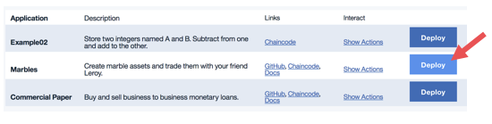


# Set up the network

Now that you have tested a Blockchain on the Cloud, let’s do the same on your machine. We will explain a little bit more the way to deploy your own Blockchain network

Install Docker on your machine [here](https://docs.docker.com/engine/installation/#platform-support-matrix)

We will use Hyperledger official Docker images to start a Blockchain network of 4 peers + 1 CA (Certificate Authority)

Images are available [here](https://hub.docker.com/u/hyperledger)

> If you encounter any problem during this lab, all the correction is available on the Github subprojects :grin:

All commands below are for Unix machines (Linux, MacOs, Debian, Ubuntu, etc… ). If you use another OS like Windows, just transcript the command. We are using very basic commands that exists on all OS. 

1. Create a Docker file from the official image. Open a console and type theses commands (choose any workspace folder on your machine)

```bash
mkdir baseimage
touch baseimage/Dockerfile
echo "FROM hyperledger/fabric-peer:x86_64-0.6.1-preview" > baseimage/Dockerfile
```

2. Create the file for Docker compose

```bash
touch four-peer-ca.yaml 
```

3. Open this new file on an editor (can double click on it from the file explorer) and type the beginning of the file

```yaml
version: '2'
services:
  baseimage:
    build: ./baseimage
    image: hyperledger/fabric-baseimage:latest

  membersrvc:
    image: hyperledger/fabric-membersrvc:x86_64-0.6.1-preview
    extends:
      file: base/membersrvc.yaml
      service: membersrvc

  vp0:
    image: hyperledger/fabric-peer:x86_64-0.6.1-preview
    extends:
      file: base/peer-unsecure-base.yaml
      service: peer-unsecure-base
    ports:
      - "7050:7050" # REST
      - "7051:7051" # Grpc
      - "7053:7053" # Peer callback events
    environment:
      - CORE_PEER_ID=vp0
    links:
      - membersrvc
    volumes:
      - /Users/benjaminfuentes/git:/chaincode
```

4. Save the file and leave it open
  
  As you can see we refer to the base image, we declare a membersrvc peer that is the Certificate Authority and only 1 peer named vp0.
  We will write the file base/membersrvc.yaml later, let’s focus on our current file now.
  
  Have a look on the peer vp0 configuration:
- We are going to write the base file for all validating peer on base/peer-unsecure-base.yaml. We are not going to use security enabled for this demo in order to simplify all API requests, also we will use the NOOPS consensus (i.e autovalidating consensus for development). You can have a look on Fabric options to enable security and configure PBFT [see here](http://hyperledger-fabric.readthedocs.io/en/v0.6/Setup/Network-setup) )
- We are translating inside containers ports to outside using “ports:” You can read it like this “localMachinePort:dockerContainerPort”
- We name the first peer vp0 (for the block section and the parameter CORE_PEER_ID)
- Finally, we add a dependency on service named membersrvc (which need to be started before)
- Parameter volumes will be used for vp0 only in order to deploy chaincode based on a file path. **Please change “/Users/benjaminfuentes/git” path with our own workspace path pointing to your chaincode project workspace directory (i.e /...../myWorkspace/myChaincodeProject )**.Explanation to read is like this “mylocalWorkspacePath:myMountedFolderOnDocker”.**Please do not change the name of the mounted folder on docker side “:/chaincode”**

> For Windows, do not forget to share C drive for example. Otherwise the mount will not work … Also respect the \ paths 

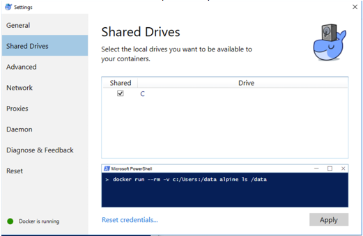

> YAML files are really boring strict with space indentation, be very careful. Copy/paste from correction files on links at the end of this document if you have any problem. Use spaces, no tabs !

4.	Now that you have understood the configuration, you can add 3 more peers at the end of this file four-peer-ca.yaml: vp1, vp2, and vp3.
- Copy paste vp0 block
- Rename peer name
- Rename CORE_PEER_ID
- Translate local machine ports with 1000 offset (i.e. vp1 from 8050 to 8053, vp2 from 9050 to 9053 and vp4 from 10050 to 10053). Inside container ports are kept the same obviously
- You do not need to mount a volume as we will deploy chaincode only on vp0.
- Also you will need to add this on the environment section to refer to the first node : 
```yaml
- CORE_PEER_DISCOVERY_ROOTNODE=vp0:7051
```
- Finally, on the links section, add a dependency to vp0
```yaml
- vp0
```

Save and close file.

5.	As that the main file is done, let’s create the common peer file base/peer-unsecure-base.yaml
```bash
mkdir base
touch base/peer-unsecure-base.yaml
```

and edit the file

```yaml
version: '2'
services:
  peer-unsecure-base:
    volumes:
      - /var/run/docker.sock:/var/run/docker.sock
    environment:
      - CORE_PEER_DISCOVERY_PERIOD=300s
      - CORE_PEER_DISCOVERY_TOUCHPERIOD=301s
      - CORE_PEER_ADDRESSAUTODETECT=true
      - CORE_VM_ENDPOINT=unix:///var/run/docker.sock
      - CORE_LOGGING_LEVEL=DEBUG
      - CORE_PEER_PKI_ECA_PADDR=membersrvc:7054
      - CORE_PEER_PKI_TCA_PADDR=membersrvc:7054
      - CORE_PEER_PKI_TLSCA_PADDR=membersrvc:7054
      - CORE_SECURITY_ENABLED=false
    command: sh -c "sleep 10; peer node start"
```

Save and close

Here we have mounted Docker socket to dialog with Docker deamon and set security enabled to false

6. Create the file for the Certificate Authority
  
```bash
  touch base/membersrvc.yaml 
```  

  and then edit it

```yaml
version: '2'
services:
  membersrvc:
    ports:
      - "7054:7054"
    command: membersrvc
    environment:
      - MEMBERSRVC_CA_LOGGING_SERVER=INFO 
      - MEMBERSRVC_CA_LOGGING_CA=INFO 
      - MEMBERSRVC_CA_LOGGING_ECA=INFO
      - MEMBERSRVC_CA_LOGGING_ECAP=INFO 
      - MEMBERSRVC_CA_LOGGING_ECAA=INFO 
      - MEMBERSRVC_CA_LOGGING_ACA=INFO 
      - MEMBERSRVC_CA_LOGGING_ACAP=INFO 
      - MEMBERSRVC_CA_LOGGING_TCA=INFO 
      - MEMBERSRVC_CA_LOGGING_TCAP=INFO 
      - MEMBERSRVC_CA_LOGGING_TCAA=INFO 
      - MEMBERSRVC_CA_LOGGING_TLSCA=INFO
```

Save and close file

7.	All is set now, let’s start the network using the command

```bash
docker-compose -f four-peer-ca.yaml up
```

To see containers running, open another terminal and send command

```bash
docker ps
```

8.	If you want to stop the network, escape the running docker compose (Ctrl + C) or use the command

```bash
docker-compose -f four-peer-ca.yaml stop
```

This will stop all containers

To see containers stopped:

```bash
docker ps -a
```

9.	If you want to destroy all containers, just run. (in case you did a mistake and you want to start from scratch from the docker-compose config files)

```bash
docker-compose -f four-peer-ca.yaml down
```

Finally test your Blockchain network with Postman.

To install Postman [here](https://www.getpostman.com)

Launch it from the menu bar and import the file from [download link](https://github.com/zamrokk/JavaCDD/blob/master/postman.json)

You can pull it from Git or save the raw text from your browser 

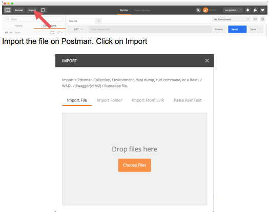

Drop the file, or browse folder

On the Collections tab, click on the first line named CHAIN V0.6. Click on button Send, you should have a response **200 OK** with chain height equals to **1**

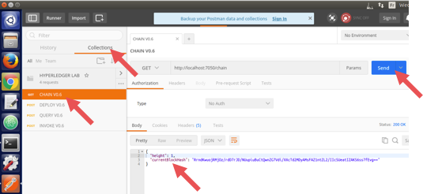


# Develop the chaincode

In the following section you will code a CDD derivative chaincode contract in Java using Hyperledger Fabric

Install [Eclipse](https://www.eclipse.org/downloads)

## Preparing the project

1. Open Eclipse and create a new Maven Project

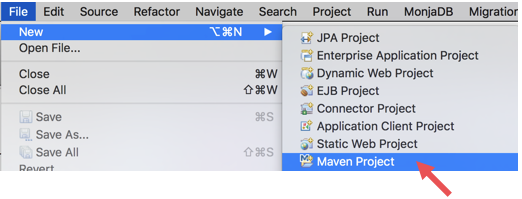


Click next

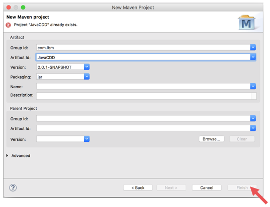

2. You need to copy some configuration files and pojos java class to help you start and let us focus on the important files.
   
Recreate the project structure as it:

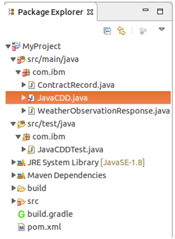

To create the com.ibm package, you do it like this:

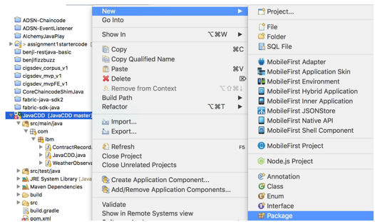

Copy theses files from the project url into its correct folder (https://github.com/zamrokk/JavaCDD):
- build.gradle
- pom.xml
- /src/main/java/com/ibm/ContractRecord.java
- /src/main/java/com/ibm/WeatherObservationResponse.java
- /src/test/java/com/ibm/JavaCDDTest.java

3. Have a look on the project structure. You have the choice to use Maven or Gradle for development but Gradle will be mandatory when the code will be deployed as Gradle file will be only run by Hyperledger on version V0.6.1
   
At the moment, you have 2 POJOs class files: 
- ContractRecord
- WeatherObservationResponse
   
You have a test class available: JavaCDDTest
   
You will be asked to code a JavaCDD class file that extends ChaincodeBase

4. Create a new class JavaCDD on package com.ibm that’s extends ChaincodeBase. You will write later a main method. You can see that some methods need to be implemented too.

5. Look at dependencies to see from which package is coming ChaincodeBase class. The fabric-sdk-java jar will be downloaded automatically during compilation. Open pom.xml and build.gradle

Maven
```xml
<dependency>
    <groupId>org.hyperledger.fabric-sdk-java</groupId>
    <artifactId>fabric-sdk-java</artifactId>
    <version>0.6</version>
</dependency>
```
Gradle
``` 
compile 'org.hyperledger.fabric-sdk-java:fabric-sdk-java:0.6'
```

This jar is available on m2 central repository so no problem :smiley:

6. Click on the red cross of the class, and click on Add unimplemented methods. Now you can do a maven compile or gradle compileJava. Both should compile fine.


To do so, open Run Configurations…

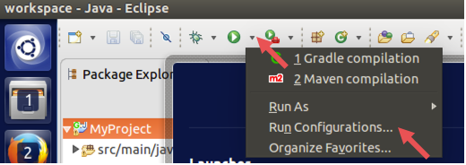

For Maven
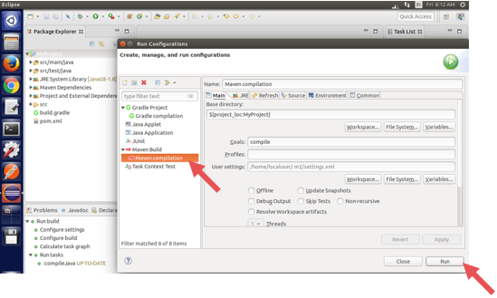

For Gradle
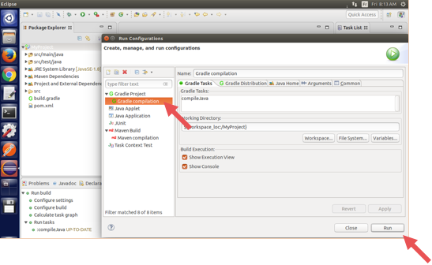

Now your project should not have any red errors. Compilation is done

## Implementing overridden methods

**Eclipse TIP:** To auto-indent files, go to top menu Source > Format (Shift+Ctrl+F)

1.	First step is to start a main thread and name your chaincode. Edit it as follow: 

```java
private static Log log =LogFactory.getLog(JavaCDD.class);

public static void main(String[] args) throws Exception {
new JavaCDD().start(args);
}

@Override
public String getChaincodeID() {
	return "JavaCDD";
}
```

2.	Start coding the entry point method run. It is the dispatcher entry point for INVOKE and DEPLOY API.
init function is used while deployment only and all others for normal invocations.

```java
@Override
/**
* Entry point of invocation interaction
* 
* @param stub
* @param function
* @param args
*/
public String run(ChaincodeStub stub, String function, String[] args) {
	log.info("In run, function:" + function);
	switch (function) {
	case "init":
		init(stub, function, args);
		break;
	case "executeContract":
		String re = executeContract(stub, args);
		log.info("Return of executeContract : " + re);
		return re;
	default:
		String warnMessage = "{\"Error\":\"Error function " + function + " not found\"}";
		log.warn(warnMessage);
		return warnMessage;
	}
	return null;
}
```

3.	Last overridden method is query. We will have to retrieve the contract state and return it back to the client. Do it as below

```java
/**
* This function can query the current State of the contract
* @param stub
* @param function
* @param args
*            client name
* @return total amount received for this client
*/
@Override
public String query(ChaincodeStub stub, String function, String[] args) {
if (args.length != 1) {
		return "{\"Error\":\"Incorrect number of arguments. Expecting name of the client to query\"}";
	}
	String clientName = stub.getState(args[0]);
	log.info("Called " + function + " on client : " + clientName);
	if (clientName != null && !clientName.isEmpty()) {
		try {
			ObjectMapper mapper = new ObjectMapper();
			ContractRecord contractRecord = mapper.readValue(clientName, ContractRecord.class);
			return "" + contractRecord.totalAmountReceived;
		} catch (Exception e) {
			return "{\"Error\":\"Failed to parse state for client " + args[0] + " : " + e.getMessage() + "\"}";
		}
	} else {
		return "{\"Error\":\"Failed to get state for client " + args[0] + "\"}";
	}
}
```

## Implementing initialization and invocation methods
  
1.	At deployment we will need to initialize the contract. Copy the code below 

```java
/**
* This function initializes the contract
* @param stub
* @param function
* @param args
*            client name, temperature threshold, amount received when
*            contract is activated
* @return
*/
public String init(ChaincodeStub stub, String function, String[] args) {
	if (args.length != 3) {
		return "{\"Error\":\"Incorrect number of arguments. Expecting 3 : client name, temperature threshold, amount received when contract is activated \"}";
	}
	try {
		ContractRecord contractRecord = new ContractRecord(args[0], Integer.parseInt(args[1]),Integer.parseInt(args[2]));
		stub.putState(args[0], contractRecord.toString());
	} catch (NumberFormatException e) {
		return "{\"Error\":\"Expecting integer value for temperature threshold and amount received\"}";
	}
	return null;
}
```

2. Then, here is the main piece. We are coding the contract for a specific location passed as parameters. We have an API call to Weather API that will return the current temperature and will compare it against the threshold of the contract. 

If the temperature is below, then the client will have its account credited with the redemption agreement amount of the contract, otherwise nothing happens.

> (Credentials of the service API have been hardcoded, you can change this value with your own credentials on Bluemix)

```java
/**
* This function calls Weather API to check if the temperature on a location
* is inferior to the contract's threshold. If yes, the client is redeemed
* for the value agreed on the contract
* 
* @param stub
* @param args
*            client name, postal Code, country Code
* @return
*/
public String executeContract(ChaincodeStub stub, String[] args) {
	log.info("in executeContract");
Boolean contractExecuted = false;

	if (args.length != 3) {
		String errorMessage = "{\"Error\":\"Incorrect number of arguments. Expecting 3: client name, postal Code, country Code\"}";
		log.error(errorMessage);
		return errorMessage;
	}
	ObjectMapper mapper = new ObjectMapper();
	ContractRecord contractRecord;
	try {
		contractRecord = mapper.readValue(stub.getState(args[0]), ContractRecord.class);
	} catch (Exception e1) {

		String errorMessage = "{\"Error\":\" Problem retrieving state of client contract : " + e1.getMessage()+ "  \"}";
		log.error(errorMessage);
		return errorMessage;
	}

	String postalCode = args[1];
	String countryCode = args[2];

	// weather service
	String url = "https://twcservice.mybluemix.net/api/weather/v1/location/" + postalCode + "%3A4%3A" + countryCode
				+ "/observations.json?language=en-GB";

	HttpClient httpclient = new DefaultHttpClient();
	HttpGet httpget = new HttpGet(url);

	SSLSocketFactory sf;
	try {
		SSLContext sslContext = SSLContext.getInstance("TLS");
		sslContext.init(null, null, null);
		sf = new SSLSocketFactory(sslContext);
	} catch (Exception e1) {
		String errorMessage = "{\"Error\":\" Problem with SSLSocketFactory : " + e1.getMessage() + "  \"}";
		log.error(errorMessage);
		return errorMessage;
	}

	sf.setHostnameVerifier(SSLSocketFactory.ALLOW_ALL_HOSTNAME_VERIFIER);
		Scheme sch = new Scheme("https", sf, 443);
		httpclient.getConnectionManager().getSchemeRegistry().register(sch);

	((AbstractHttpClient) httpclient).getCredentialsProvider().setCredentials(
				new AuthScope(AuthScope.ANY_HOST, AuthScope.ANY_PORT),
				new UsernamePasswordCredentials("dfa7551a-2613-4f5c-bff7-339649770aa5", "gvbmK5JsGO"));

	HttpResponse response;
	try {
		response = httpclient.execute(httpget);

		log.info("Called Weather service");

		int statusCode = response.getStatusLine().getStatusCode();

		HttpEntity httpEntity = response.getEntity();
		String responseString = EntityUtils.toString(httpEntity);

		if (statusCode == HttpStatus.SC_OK) {

			log.info("Weather service call OK");

			WeatherObservationResponse weatherObservationResponse = mapper.readValue(responseString,WeatherObservationResponse.class);

			if (weatherObservationResponse.getObservation().getTemp() < contractRecord.temperatureThreshold) {
					// then please redeem the client
				contractRecord.totalAmountReceived += contractRecord.amountReceivedWhenContractIsActivated;
				stub.putState(contractRecord.clientName, contractRecord.toString());
				log.info("Contract condition valid " + weatherObservationResponse.getObservation().getTemp() + " < "
							+ contractRecord.temperatureThreshold);
                 contractExecuted=true;
			} else {
				log.info("Contract condition invalid " + weatherObservationResponse.getObservation().getTemp()+ " > " + contractRecord.temperatureThreshold);
			}

		} else {
			String errorMessage = "{\"Error\":\"Problem while calling Weather API : " + statusCode + " : "+ responseString + "\"}";
			log.error(errorMessage);
			return errorMessage;
		}

	} catch (Exception e) {
		String errorMessage = "{\"Error\":\"Problem while calling Weather API : " + e.getMessage() + "\"}";
		log.error(errorMessage);
		try {
			log.error(new ObjectMapper().writerWithDefaultPrettyPrinter().writeValueAsString(e.getStackTrace()));
		} catch (JsonProcessingException e2) {
			e2.printStackTrace();
		}
		return errorMessage;
	}

	return contractExecuted.toString();
}
```


# Test with HTTP API

## Local testing

We will use Mockito to mock the Blockchain and detect any problem in our code before deploying it.

For more info about [mockito](http://site.mockito.org)   
 


1.	On your project, go to folder /src/test/java. You will find a class named JavaCDDTest

There are two Junit test cases on it.
Nice test case should always execute the contract but not increment the client’s account
Fairbanks should increment (as it is very cold there!)

Logs and Eclipse debug mode should be enough for you to check if the redeem amount has changed.

2.	Compile all with Maven before launching tests, doing a Maven Install

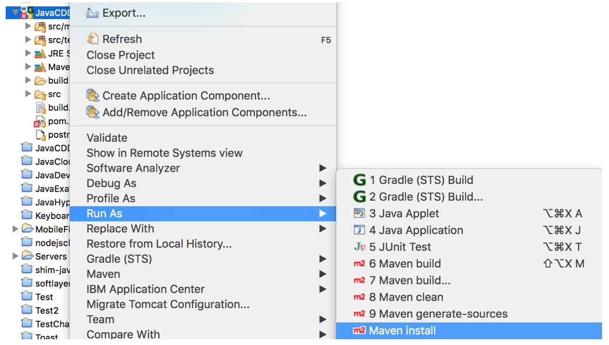

3.	Launch the Junit tests. Right click on project or test file and click Run as > JUnit Test or Debug as > JUnit Test

> All tests should have passed green. Check then the logs, to see if scenarios have run as expected. If you are not sure, run on debug mode and add breakpoints to your code

## Deployment

As your chaincode is running correctly locally with a mocked Blockchain, it is time to deploy it on the real one.

To deploy a chaincode we will use the HTTP API with Postman

1. Open Postman and run DEPLOY V0.6

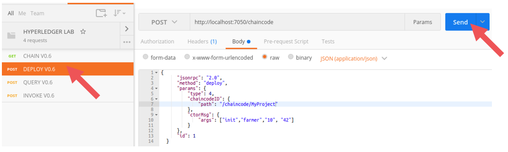

> (Optional) 
Be sure that your Blockchain network is running (see Part 1)
Also check that your project name is corresponding to the mounted path /chaincode/JavaCDD. Use docker to list files on mounted folder
(replace in red by your vp0 container id). Ajust the container path in Postman it your project is located differently.

```bash
docker exec -it PEERVP0CONTAINERID /bin/bash
ls /chaincode
```
> (Optional)
There is another way to deploy a chaincode using not a path by an url, just replace the path value by the url.

You should have a **200 OK**

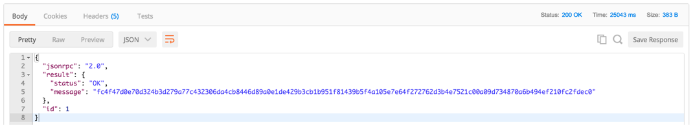

> In the returned Json, copy the value of result>message. It is the unique identifier of your chaincode, you will need it for after 

The deployment is asynchronous. Even if Hyperledger send you back a correct response, it just means that your request was correct and has been processed. To be sure that the new smart contract has been started, go to a console and do a docker ps. If you see a container name containing the chaincode ID of your request, it means the smart contract is running. Speed depends on the performance of your machine and the size of the code, it can take from 2s to few minutes

If you see an ERROR in the peer container vp0 logs, you may had a path not pointing to your project location … Check it well.
If all is OK, 4 new containers have been created and are running. Their names contains the chaincodeID you got and the response.

2.	Call the query you coded to see if the default amount has been initialized

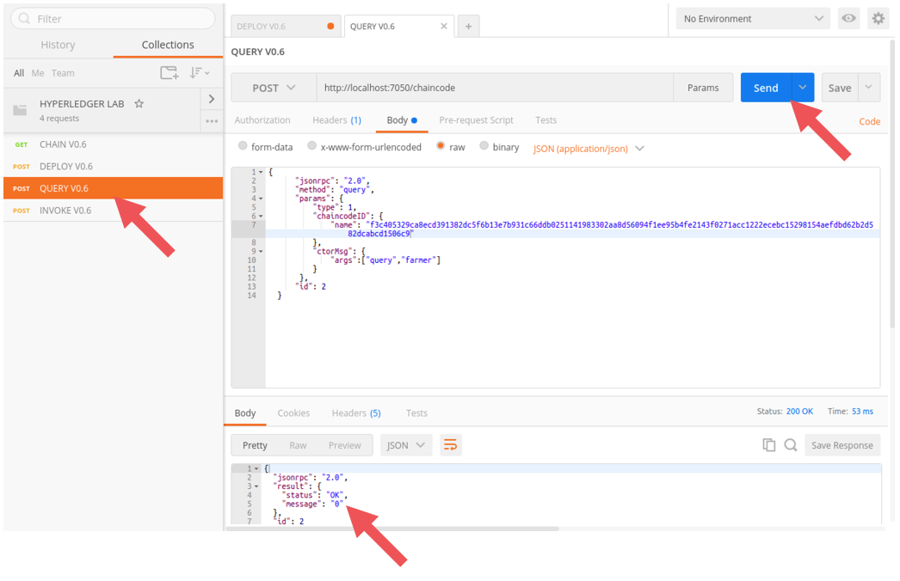

You should have a **zero amount** on the message returned

> On the request body, do not forget to change params>chaincodeID>name by the one returned on the previous step

## Interact more with your chaincode

1. Run INVOKE V0.6

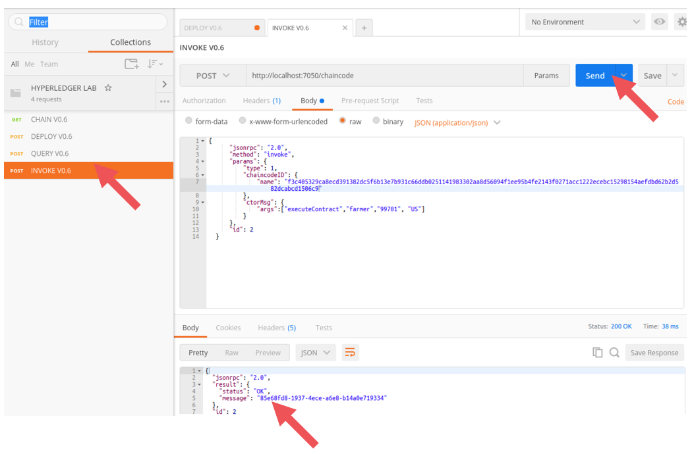

Do not forget to change the chaincodeID as step before, let the default parameters pointing to Fairbanks and you should have a response **200 OK**. 

For information, the data result>message on the response corresponds to the transaction ID

Let’s call the query again to check the result 

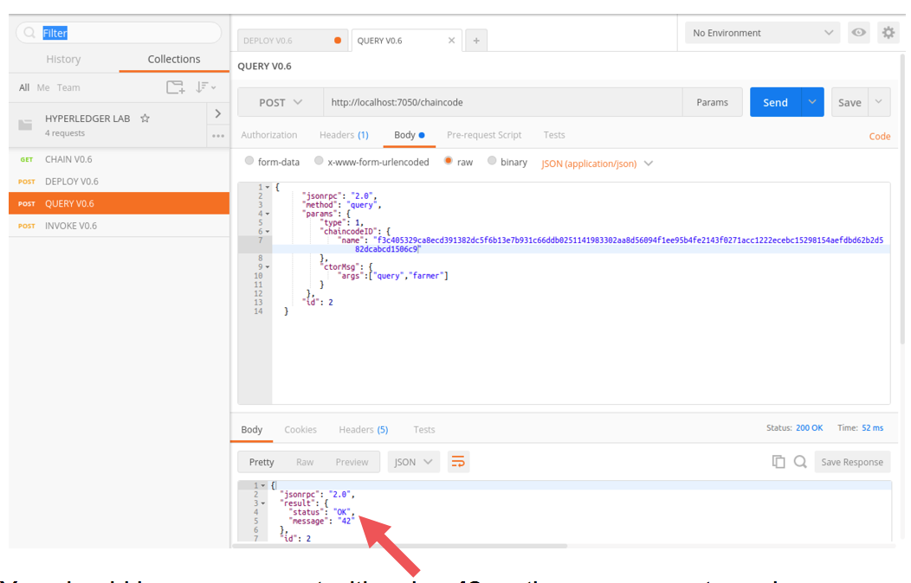

You should have an amount with value **42** on the message returned. This confirms that your farmer has been credited of 42$.


# Develop the application with SDK

## Initialization

We will now use the Java SDK to interact with our blockchain instead of the HTTP API. HTTP API will be deprecated on V1.0 of Hyperledger so we will need to use GRPC channel to communicate with the network, it on what is based the SDK.

We want to use a real java client app to keep our wallet safe, so we choose to use a simple spring boot project and build an API over it for testing (You could do it with any other java application using JavaFx, Swing or whatever support the SDK which is built on java 8)

1. Create a new maven Project in Eclipse named JavaCDDWeb

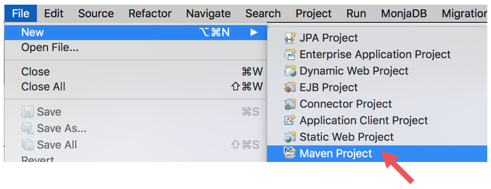

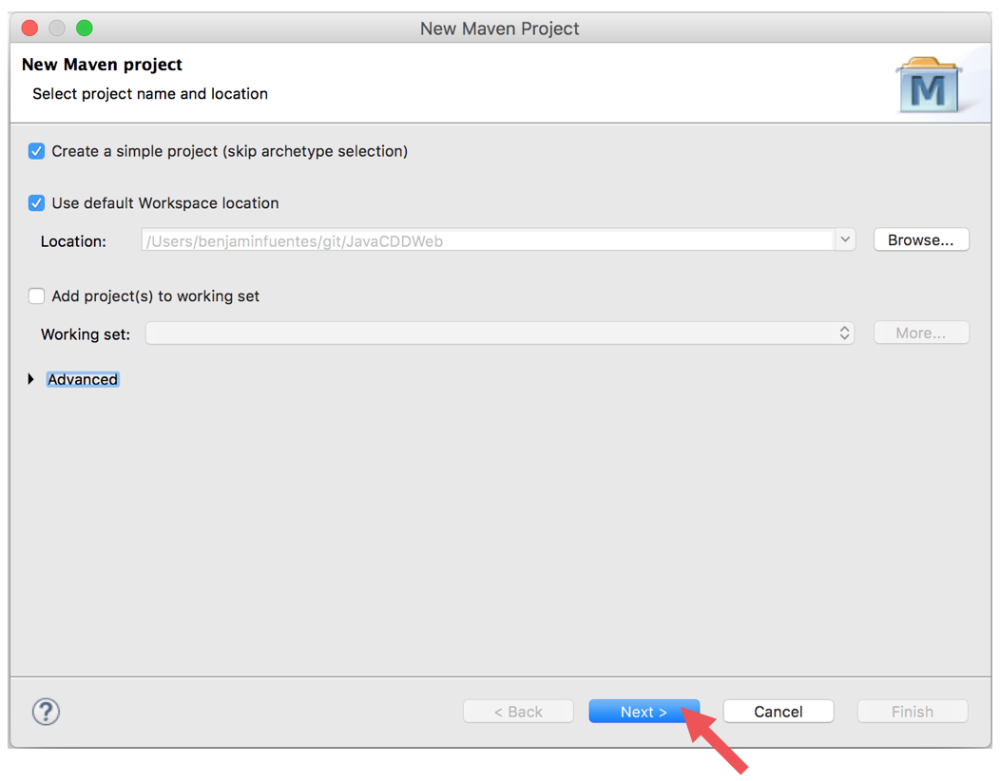

Skip the archetype selection, use the default workspace location

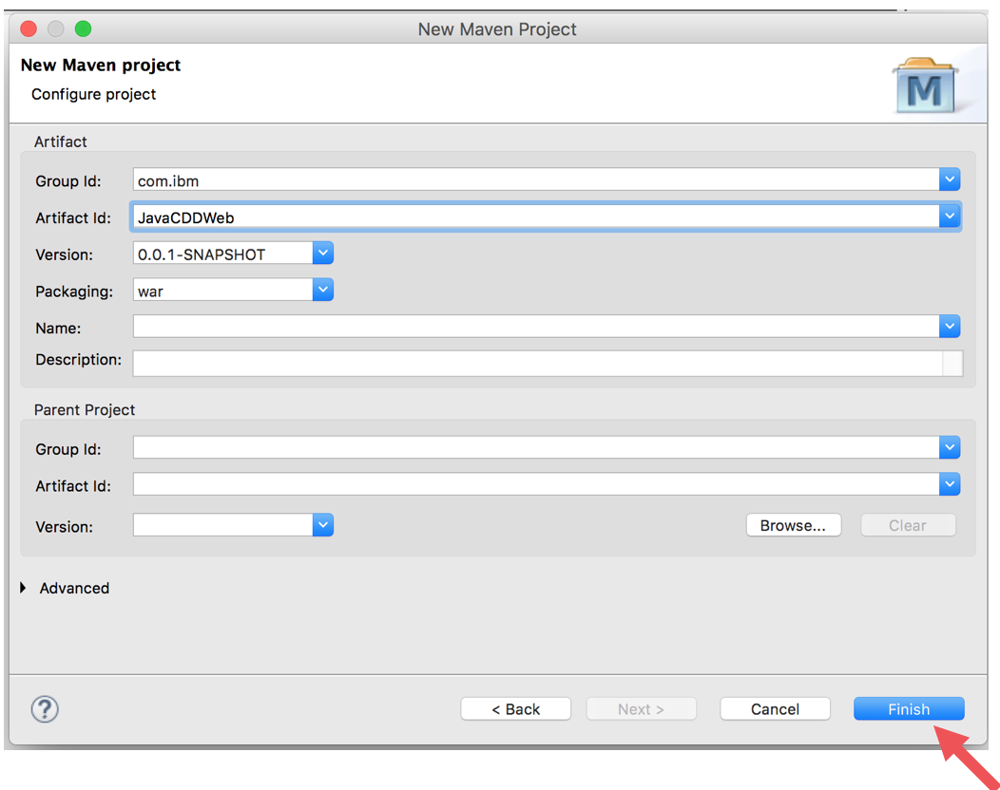

you can edit as above, but we will override it on the next step anyway

2.	Edit pom.xml

```xml
<project xmlns="http://maven.apache.org/POM/4.0.0" xmlns:xsi="http://www.w3.org/2001/XMLSchema-instance"
	xsi:schemaLocation="http://maven.apache.org/POM/4.0.0 http://maven.apache.org/xsd/maven-4.0.0.xsd">
	<modelVersion>4.0.0</modelVersion>
	<groupId>com.ibm</groupId>
	<artifactId>JavaCDDWeb</artifactId>
	<version>0.0.1-SNAPSHOT</version>

	<parent>
		<groupId>org.springframework.boot</groupId>
		<artifactId>spring-boot-starter-parent</artifactId>
		<version>1.3.5.RELEASE</version>
	</parent>

	<packaging>war</packaging>

	<dependencies>
		<dependency>
			<groupId>me.reactiv.fabric-java-sdk</groupId>
			<artifactId>fabric-java-sdk</artifactId>
			<version>0.6.6</version>
		</dependency>


		<dependency>
			<groupId>org.springframework.boot</groupId>
			<artifactId>spring-boot-starter-web</artifactId>
		</dependency>

	</dependencies>

	<build>
		<plugins>
			<plugin>
				<groupId>org.apache.maven.plugins</groupId>
				<artifactId>maven-compiler-plugin</artifactId>
				<configuration>
					<source>1.8</source>
					<target>1.8</target>
				</configuration>
			</plugin>
			<plugin>
				<groupId>org.springframework.boot</groupId>
				<artifactId>spring-boot-maven-plugin</artifactId>
			</plugin>
		</plugins>
	</build>

	<dependencyManagement>
		<dependencies>
			<dependency>
				<groupId>org.springframework.boot</groupId>
				<artifactId>spring-boot-starter-parent</artifactId>
				<version>1.3.5.RELEASE</version>
				<scope>import</scope>
				<type>pom</type>
			</dependency>
		</dependencies>
	</dependencyManagement>

</project>
```

This is the simplest configuration that we can have to have a REST API ready

You maybe have noticed that we have changed the SDK dependency. It is because, we will need the last version of the Git branch 0.6 and it has not been released officially yet on Maven Central. 

3. Create a controller class named MyController on the package com.ibm.controller 

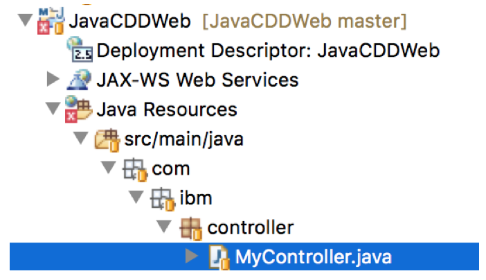

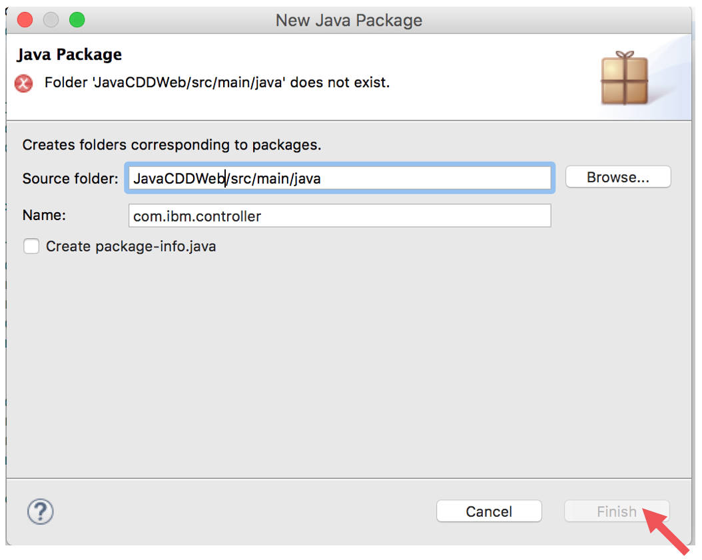

Create new java package and a new class MyController

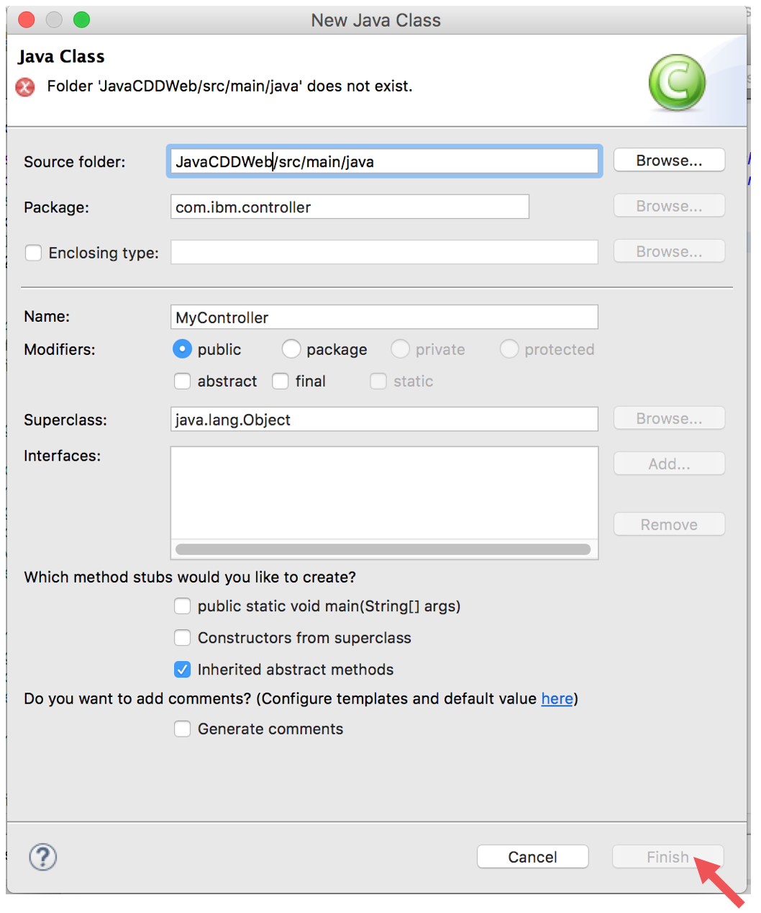

4.	Edit MyController.java

```java
@RestController
@EnableAutoConfiguration
public class MyController {

	private static Log logger = LogFactory.getLog(MyController.class);

	private Member registrar;

	private String chainCodeID;
	
	private Chain chain;

	public static void main(String[] args) throws Exception {
		SpringApplication.run(MyController.class, args);
	}

}
```

For the moment, you can run MyController as a Java Application but does nothing more than starting a server and exposing the controller on http://localhost:8080

**TIP:** If you start Spring Boot application and you have the port 8080 already in use, please kill the other process like this :
```bash
lsof -i tcp:8080
kill mypidijustfoundwiththepreviouscommand
```

**TIP:** If you have any problem with JRE, just check you are using JDK8 on your project. Right click on your project, click on buildpath and see with JDK you are using.

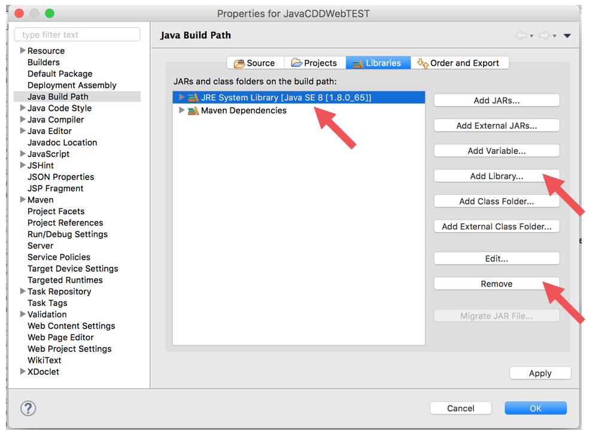

It is not JDK 8, remove the library, then click on the right panel to add library

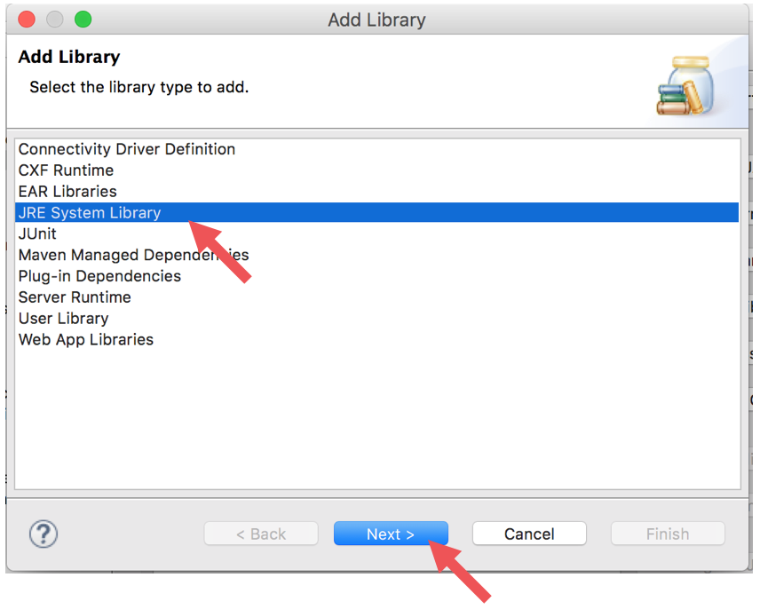

Then select JDK8 library and confirm


Also sometimes Eclipse complains about JDK compliance, you can right click on project, Properties and filter “compliance”. You should have Java compiler compliance >= 1.7

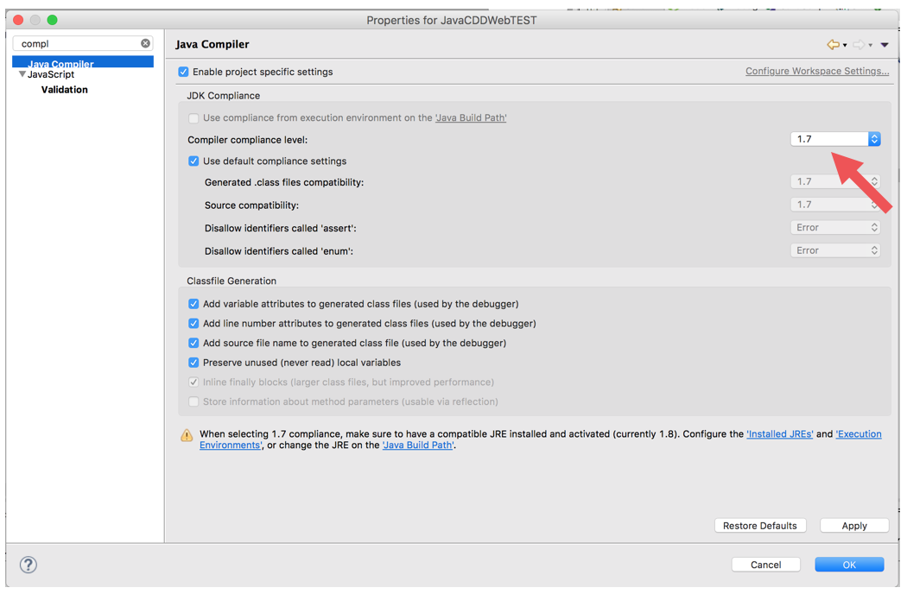

## Deployment

1. Write the Constructor and deploy function

```java
public MyController() throws Exception {
		logger.info("In MyController constructor ...");

		 chain = new Chain("javacdd");
		 chain.setDeployWaitTime(60*5);
		try {

			chain.setMemberServicesUrl("grpc://localhost:7054", null);
			// create FileKeyValStore
			Path path = Paths.get(System.getProperty("user.home"), "/test.properties");
			if (Files.notExists(path))
				Files.createFile(path);
			chain.setKeyValStore(new FileKeyValStore(path.toString()));
			chain.addPeer("grpc://localhost:7051", null);

			registrar = chain.getMember("admin");
			if (!registrar.isEnrolled()) {
				registrar = chain.enroll("admin", "Xurw3yU9zI0l");
			}
			logger.info("registrar is :" + registrar.getName() + ",secret:" + registrar.getEnrollmentSecret());
			chain.setRegistrar(registrar);
			chain.eventHubConnect("grpc://localhost:7053", null);

			chainCodeID = deploy();

		} catch (CertificateException | IOException  e) {
			logger.error(e.getMessage(), e);
			throw new Exception(e);
		}
		logger.info("Out MyController constructor.");

	}
```

Chain object will represent the chaincode deployed.

We are configuring MemberServices url in order to register a user admin and get the signing & encryption certificates that we will store in our local wallet saved under test.properties file.

We are configuring the peer to whom we will discuss with

We are enrolling the user admin the first time to get the keys, but next time we will retrieve it from the local wallet on the machine. Be careful in case you failed storing the keys the first time because the CA will consider that the user has been enrolled and we no more deliver the keys. You will need to clean all CA database so we recommend to destroy the full network with docker-compose and redo a new one.

We are connecting to peer eventhub to catch all failures and success messages after we call invocation methods. As the system is asynchronous, it is the only way to know if the grpc call finally succeeded.

Finally, we are deploying our chaincode and get the chaincodeID back

2.	Write the deploy function now. **Your path should point to the folder of your chaincode project**

```java
String deploy() throws ChainCodeException, NoAvailableTCertException, CryptoException, IOException {
		DeployRequest deployRequest = new DeployRequest();
		ArrayList<String> args = new ArrayList<String>();
		args.add("init");
		args.add("farmer");
		args.add("10");
		args.add("42");
		deployRequest.setArgs(args);
		deployRequest.setChaincodePath(Paths.get(System.getProperty("user.home"), "git", "JavaCDD").toString());
		deployRequest.setChaincodeLanguage(ChaincodeLanguage.JAVA);
		deployRequest.setChaincodeName(chain.getName());

		ChainCodeResponse chainCodeResponse = registrar.deploy(deployRequest);
		return chainCodeResponse.getChainCodeID();
	}
```

We are building a DeployRequest and the registrar is submitting it to the peer (the SDK signing under the hood)
Finally we return the chaincodeID that needs to be used later

## Queries

Let’s write our query to obtain the total redeemed amount of a client 

```java
@RequestMapping(method = RequestMethod.GET, path = "/query", produces = { MediaType.APPLICATION_JSON_VALUE })
	@ResponseBody
	String query(@RequestParam String clientName) throws JsonProcessingException {

		logger.info("Calling /query ...");

		QueryRequest queryRequest = new QueryRequest();
		ArrayList<String> args = new ArrayList<String>();
		args.add("query");
		args.add(clientName);
		queryRequest.setArgs(args);
		queryRequest.setChaincodeLanguage(ChaincodeLanguage.JAVA);
		queryRequest.setChaincodeID(chainCodeID);

		try {
			ChainCodeResponse chainCodeResponse = registrar.query(queryRequest);
			logger.info("End call /query.");

			return new ObjectMapper().writeValueAsString(chainCodeResponse);
		} catch (ChainCodeException | NoAvailableTCertException | CryptoException | IOException e) {
			logger.error("Error", e);
			return new ObjectMapper().writeValueAsString(e);
		}

		
	}
```

We are exposing a GET API under /query and we need the client name on input. We are building a QueryRequest object that will be submitted by the registrar, etc … the response will be sent on the body of the message on JSON format

## Invocations

Same as above but for the invocation function of the chaincode

```java
@RequestMapping(method = RequestMethod.GET, path = "/executeContract", produces = { MediaType.APPLICATION_JSON_VALUE })
	@ResponseBody
	String executeContract(@RequestParam String clientName, @RequestParam String postalCode,
			@RequestParam String countryCode) throws JsonProcessingException {

		logger.info("Calling /executeContract ...");
		InvokeRequest invokeRequest = new InvokeRequest();
		ArrayList<String> args = new ArrayList<String>();
		args.add("executeContract");
		args.add(clientName);
		args.add(postalCode);
		args.add(countryCode);
		invokeRequest.setArgs(args);
		invokeRequest.setChaincodeLanguage(ChaincodeLanguage.JAVA);
		invokeRequest.setChaincodeID(chainCodeID);
		invokeRequest.setChaincodeName(chain.getName());

		try {
			
			
			ChainCodeResponse chainCodeResponse = registrar.invoke(invokeRequest);
			logger.info("End call /executeContract.");

			return new ObjectMapper().writeValueAsString(chainCodeResponse);
		} catch (ChainCodeException | NoAvailableTCertException | CryptoException | IOException e) {
			logger.error("Error", e);
			return new ObjectMapper().writeValueAsString(e);
		}

	}
```

We are exposing a GET API under /executeContract and we need the client name, postal code and country code on input. We are building an InvokeRequest object that will be submitted by the registrar, etc … the response will be sent on the body of the message on JSON format

# Test with the Spring Boot application

1.	So you have now a client application that runs on a secured network.
Let’s do some modifications on the work done on Part1 to make it secure.

Remember the file /base/peer-unsecure-base.yaml, edit now this property:

```yaml
- CORE_SECURITY_ENABLED=true
```

Also, the peers will need to be authenticated on the network, not only the users, so for each peer on the file four-peer-ca.yaml, add these new properties on the block environment

For vp0:
```yaml
- CORE_SECURITY_ENROLLID=test_vp0
- CORE_SECURITY_ENROLLSECRET=MwYpmSRjupbT
```

For vp1:
```yaml
- CORE_SECURITY_ENROLLID=test_vp1
- CORE_SECURITY_ENROLLSECRET=5wgHK9qqYaPy
```

For vp2:
```yaml
- CORE_SECURITY_ENROLLID=test_vp2
- CORE_SECURITY_ENROLLSECRET=vQelbRvja7cJ
```

For vp3:
```yaml
- CORE_SECURITY_ENROLLID=test_vp3
- CORE_SECURITY_ENROLLSECRET=9LKqKH5peurL
```

2. Now that the network runs with security enabled, you will need to add extra security jars to your JDK.

Download [this zip](http://www.oracle.com/technetwork/java/javase/downloads/jce8-download-2133166.html), and extract it on the folder **${java.home}/jre/lib/security/**

3. You will have to solve an issue due to official Hyperledger images. It refers to a Docker javaenv image named hyperledger/fabric-javaenv:latest .Sadly this image does not exist so here is the trick :

```bash
docker pull hyperledger/fabric-javaenv:x86_64-0.6.1-preview
docker tag hyperledger/fabric-javaenv:x86_64-0.6.1-preview hyperledger/fabric-javaenv:latest
```

4. You will need to destroy your network and rebuild it with docker-compose

```bash
docker-compose -f four-peer-ca.yaml down
docker-compose -f four-peer-ca.yaml up
```

5. Compile all with Maven

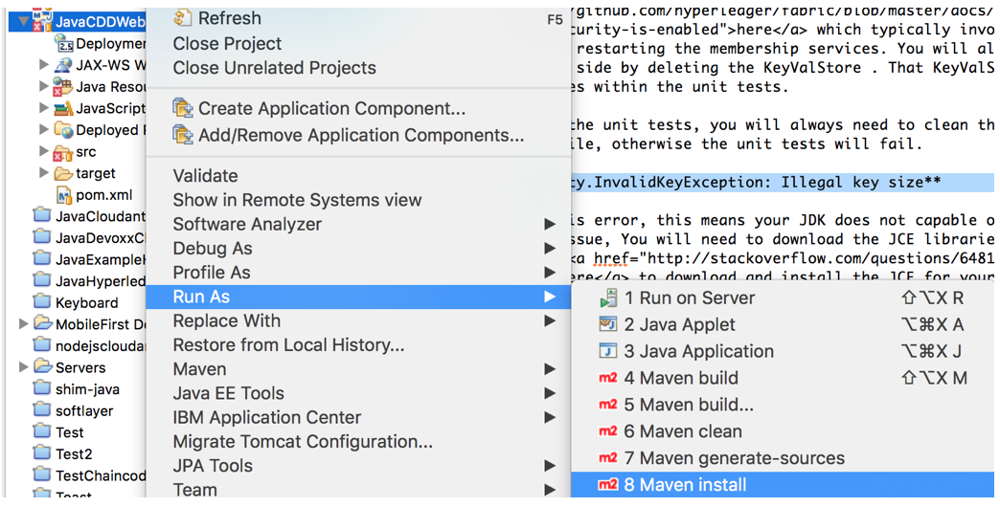

6. Now you can start you Spring Boot Application

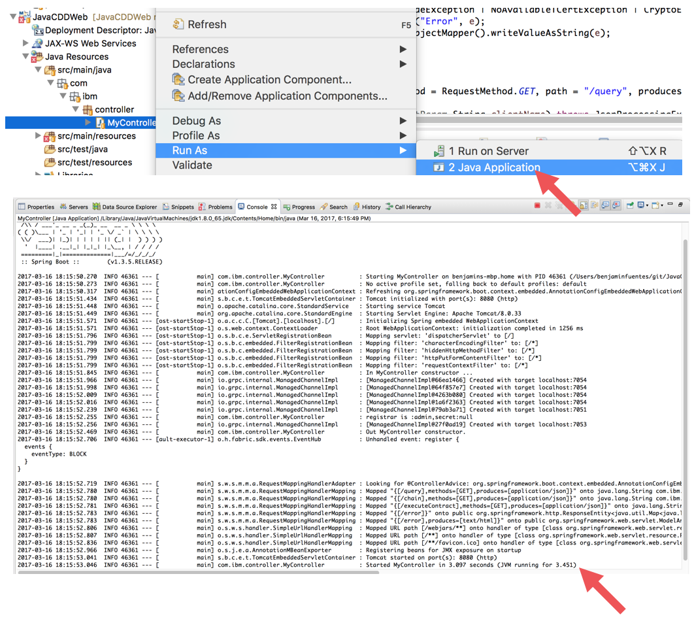

> If you have an error “Identity or token does not match”. Is because you have launched several time your server and maybe you have crashed on the client side getting a broken certificate. As the Member Service on the Blockchain network will accept only to send you one time this credentials, the best is to destroy the network and relaunch it again. Also, delete the wallet on your local path ~/test.properties. Then launch again your Spring boot application.

7. Open again Postman and select QUERY CLIENT V0.6, click on SEND

You should have the API responding SUCCESS with **message “0”** if the client has not been redeemed yet

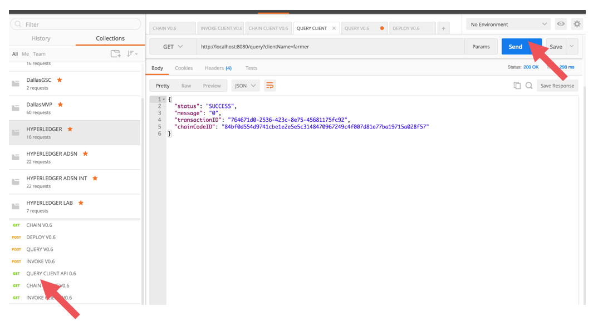

8. Now select INVOKE CLIENT V0.6, click on SEND

You should have the API responding SUCCESS 

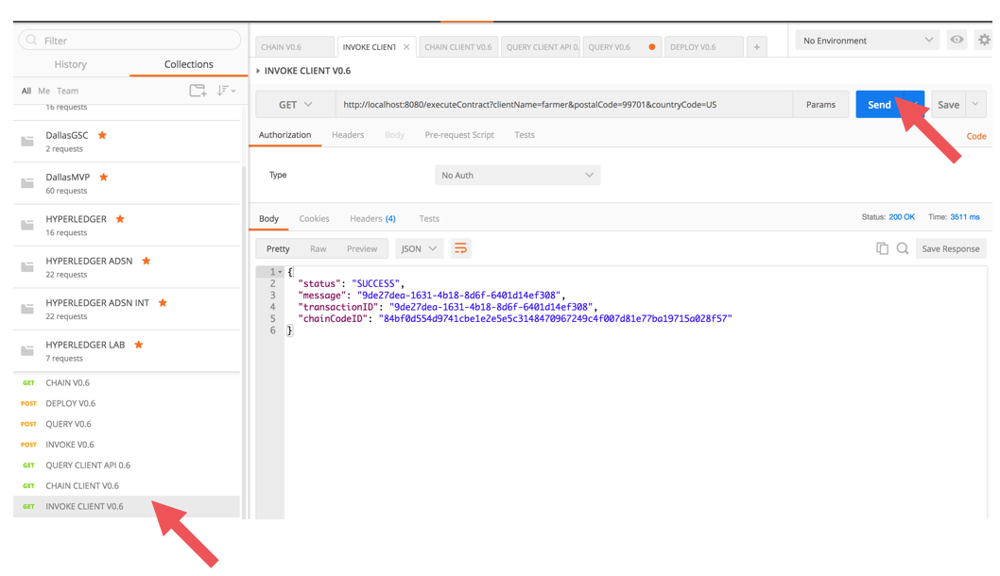

9. Try again QUERY CLIENT V0.6, click on SEND

You should have the API responding SUCCESS with **message “42”** because the client has been redeemed

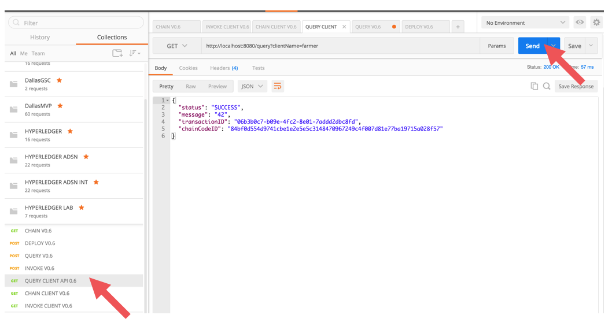


## CONGRATULATIONS !!!


You have successfully invoked your chaincode and incremented the client account. You know can now:
- Change location parameters while invoking chaincode
- Change the code adding begin and end date validity checks
- Plug another temperature feed from an external API service or IoT device
- Make the code more deterministic !

## Contributing
[link](CONTRIBUTING.md)

## Troubleshooting
[maintainers link](MAINTAINERS.md)

## References
- [JavaCDD](https://github.com/zamrokk/JavaCDD) : the chaincode java project
- [JavaCDDNetwork](https://github.com/zamrokk/JavaCDDNetwork) : the scripts to create / destroy the blockchain network locally 
- [JavaCDDWeb](https://github.com/zamrokk/JavaCDDWeb): the client web application using the JavaSDK and exposing an API

# License
[Apache 2.0](LICENSE)
